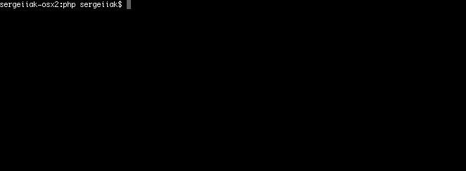
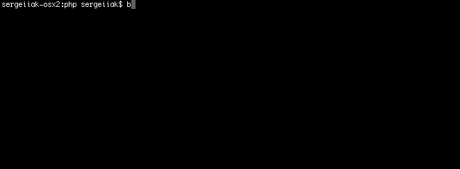
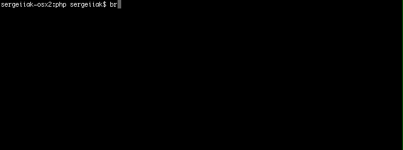
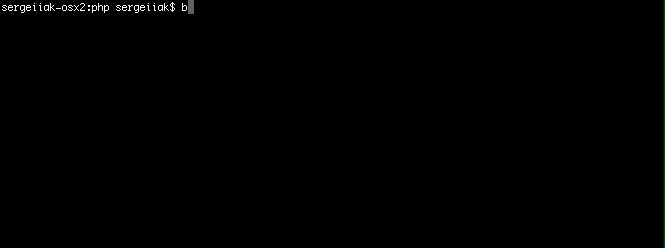

# Project Brain Games
## Getting Started
### Install
composer global require se0ga/brain-games (add composer in PATH)

### Launch
#### brain-games
This command will ask your name and say hello.

How it works

  
  
  

#### brain-even
This command will check that you know which number is even and which is not.

How it works

  
  
  

#### brain-calc
This command will check that you remember how to make those operations +, -, * .

How it works

  
  
  

#### brain-gcd
This command will check that you remember how to find greatest common divisor.

How it works

  
  
  

#### brain-balance
This command will check that you know how to balance number.

How it works

  
  

#### brain-progression
This command will check that you know how to find missed number in arithmetic progression.

How it works

  
  

#### brain-prime
This command will check that you know which number is prime and which is not.

How it works

  
  

